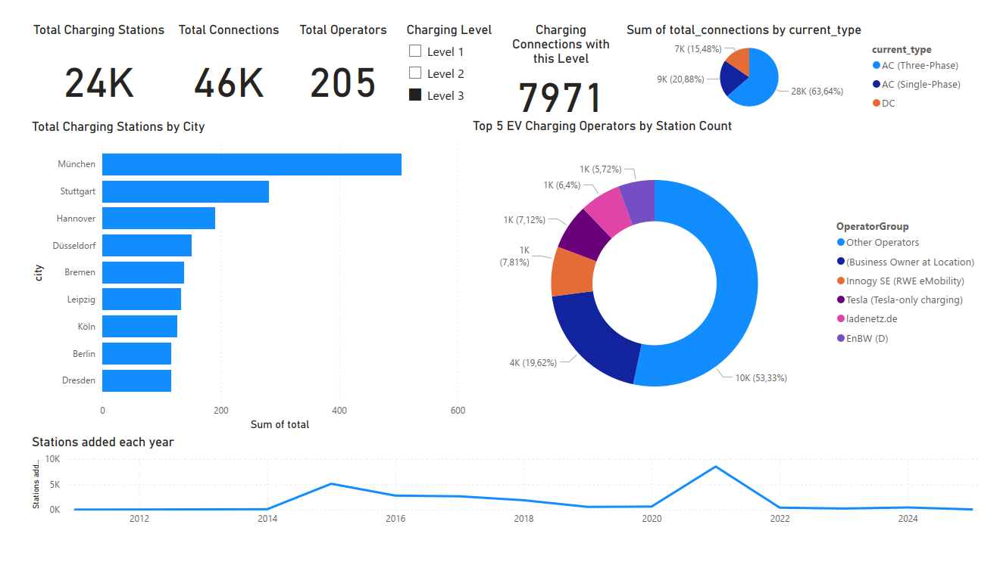

# EV Charging Stations Analysis (Germany)
This project provides a complete **ETL + SQL + Dashboard** workflow using public EV charging station data from [Open Charge Map](https://openchargemap.org/). The focus is on **Germany**.

---
## Project Overview

- Extracts EV station data via the OpenChargeMap API
- Cleans and transforms data using Python (ETL pipeline)
- Loads structured data into a PostgreSQL database
- Explores the data with advanced SQL queries
- Visualizes insights with **Power BI**

---

## Tech Stack

| Tool          | Purpose                        |
|---------------|--------------------------------|
| Python        | ETL pipeline (requests, pandas)|
| PostgreSQL    | Data storage + querying        |
| Power BI      | Dashboard + data visualization |
| SQL           | Analytical queries (CTEs, JOINs)|
| Metabase (Alt)| Optional free dashboarding     |

---


## ETL Workflow – Open Charge Map (Germany)

This notebook-based ETL pipeline extracts, transforms, and loads electric vehicle charging station data from the **Open Charge Map API**, focusing on Germany. The result is a structured dataset split into normalized tables, ready for SQL import or dashboarding in Power BI.

---

### Workflow Overview

| Phase         | Description                                                                 |
|---------------|-----------------------------------------------------------------------------|
| **Extract**   | Fetches charging station data from OpenChargeMap via API                   |
| **Transform** | Cleans, normalizes, and separates data into relational table formats        |
| **Load**      | Saves each table to CSV files for later use in PostgreSQL or BI tools       |

---

### 1️. Extract – API Data Collection (Notebook Cell 1)

This part of the notebook:

- Uses a **grid of lat/lon coordinates** to cover all of Germany
- Paginates through results per tile using `offset` and `maxresults`
- Includes a **DEV_MODE** for testing smaller batches
- Stores results as a single raw `.json` file

Output:  
```bash
/data/ocm_germany_full.json
```

### 2️. Transform & Load – JSON to Structured CSVs (Notebook Cell 2)

This part of the notebook:

- Loads the raw `ocm_germany_full.json` data
- Parses nested JSON structures (e.g., `Connections`, `OperatorInfo`, `AddressInfo`)
- Normalizes and flattens the data into SQL-ready tables:
  - One-to-many: `stations → connections`
  - One-to-one: `stations → operators`, `countries`, etc.
- Applies explicit data types (`Int64`, `string`, `float64`, `boolean`) to handle missing values properly
- Rounds numeric values where needed (e.g. `power_kW`)
- Writes cleaned and typed tables into CSV format for SQL import

Output:
```bash
/data/charging_stations.csv
/data/connections.csv
/data/operators.csv
/data/countries.csv
/data/current_types.csv
/data/connection_types.csv
```


## SQL Exploration and Insights
After storing the cleaned data in a **PostgreSQL** database, a series of SQL queries were used to extract key insights.

---

### Database Schema

**Main Tables:**

- `charging_stations`: Metadata for each station (location, operator, status, etc.)
- `connections`: Individual charging connectors at stations (power, type, etc.)
- `operators`: Charging network operators
- `countries`: Country metadata (focus: Germany)
- `current_types`: AC vs. DC classification

The schema follows a **relational structure**, where:
- A station can have **multiple connections**
- A station belongs to one **operator**, one **country**, and has a **status**, **usage type**, and **data provider**

---
### Query 1: Total Number of Stations & Connections

This query calculates the overall size of the network by counting:

- The total number of charging stations
- The total number of individual charging connections

SQL:
```sql
SELECT
    (SELECT COUNT(station_id) FROM charging_stations) AS total_stations,
    (SELECT COUNT(connection_id) FROM connections) AS total_connections;
```

**Insights:**
This KPI gives a quick overview of Germany’s EV infrastructure scale.
It helps gauge the nationwide reach and density of the charging network.
Useful for tracking growth over time or comparing to other countries.


---

### Query 2: Number of Stations per City

This query shows how charging infrastructure is distributed across German cities.  
It counts the number of stations in each city and groups the results by city and country.

SQL:
```sql
SELECT
    city, 
    COUNT(station_id) AS total,
    country_id
FROM   
    charging_stations
GROUP BY
    city,
    country_id
ORDER BY
    total DESC;
```
**Insights:**
- Identifies urban centers with the most charging stations.
- Helps prioritize locations for future infrastructure expansion.
- Useful for visualizations like bar charts or city-wise maps.

---

### Query 3: Number of Connections by Connection Type

This query reveals how frequently each connection type (e.g., CCS, Type 2, CHAdeMO) appears in the dataset.  
It joins the `connections` table with `connection_types` to get readable names.

SQL:
```sql
SELECT
    ct.title,
    c.connection_type_id,
    COUNT(connection_id) AS total_of_specific_connection_type
FROM
    connections c
JOIN    
    connection_types ct ON c.connection_type_id = ct.connection_type_id
GROUP BY
    ct.title,
    c.connection_type_id
ORDER BY
    total_of_specific_connection_type DESC;
```

**Insights:**
- Shows the most common connector types used across stations.
- Useful for visualizing the adoption of standards like CCS or CHAdeMO.
- Can be shown as a bar chart or donut chart in your dashboard.


---

### Query 4: Number of Connections by Current Type (AC/DC)

This query counts how many connections use each type of electrical current (e.g., AC, DC).  
It joins `connections` with `current_types` to get the human-readable names.

 SQL:
```sql
SELECT
    ct.title AS current_type,
    COUNT(c.connection_id) AS total_connections
FROM
    connections c
JOIN
    current_types ct ON c.current_type_id = ct.current_type_id
GROUP BY
    ct.title
ORDER BY
    total_connections DESC;
```

**Insights:**
- Helps identify the distribution of AC vs. DC chargers.
- Important for understanding charging speed and infrastructure maturity.
- Ideal for use in a pie chart to show share of current types.

---

### Query 5: Number of Connections and Distinct Connection Types per Station

This query determines how many total connections each charging station offers,  
as well as how many **different connection types** are available at each location.

SQL:
```sql
SELECT
    cs.station_id,
    cs.title,
    COUNT(c.connection_id) AS number_of_connections,
    COUNT(DISTINCT c.connection_type_id) AS distinct_connection_types
FROM
    connections c
JOIN
    charging_stations cs ON c.station_id = cs.station_id
GROUP BY
    cs.station_id, cs.title
ORDER BY
    number_of_connections DESC;
```
**Insights:**
- Identifies high-capacity stations and those offering versatile charging options.
- Useful for EV drivers looking for stations with multiple plug types.
- Great for a bar chart or bubble chart where size = number of connections, color = # of types.


---

### Query 6: Distribution of Charging Power Levels

This query counts how many connections exist for each distinct `power_kw` rating.  
It helps analyze the **availability of charging speeds** across the network.

SQL:
```sql
SELECT
    power_kw,
    COUNT(connection_id) AS amount_of_that_power
FROM
    connections
GROUP BY
    power_kw
ORDER BY
    amount_of_that_power DESC;
```

**Insights:**
- Reveals the most common charging power levels (e.g., 22 kW, 50 kW, 150 kW).
- Useful for infrastructure planning and understanding user accessibility.
- Great for a column/bar chart visualizing power distribution across Germany.


---

### Query 7: Number of Connections by Charging Level

This query counts how many connections exist for each `level_id`, which indicates the **charging speed level** (e.g., Level 1, 2, 3).

📄 SQL:
```sql
SELECT
    level_id,
    COUNT(connection_id) AS total_connections_of_level_3
FROM    
    connections
GROUP BY
    level_id;
```

**Insights:**
- Helps identify how many fast chargers (Level 3) exist in the dataset.
- Enables breakdown of slow/medium/fast chargers for strategic placement.
- Useful for a donut chart or bar chart comparing the popularity of charging levels.


---

### Query 8: Stations Added per Year (Last 20 Years)

This query analyzes how many charging stations were added each year over the past decade.

📄 SQL:
```sql
SELECT
    DATE_TRUNC('year', date_created) AS year,
    COUNT(*) AS stations_added
FROM
    charging_stations
WHERE
    date_created >= CURRENT_DATE - INTERVAL '20 year'
GROUP BY
    year
ORDER BY
    year;
```

**Insights:**
- Shows the growth trend of EV infrastructure in Germany.
- Useful for identifying years with spikes or drops in station deployment.
- Ideal for line charts or column charts in Power BI.


---

### Query 9: Operators with the Most Stations

This query identifies which charging operators manage the largest number of stations.

SQL:
```sql
SELECT
    op.title,
    COUNT(op.operator_id) AS total_stations
FROM
    operators op
JOIN
    charging_stations cs ON op.operator_id = cs.operator_id
GROUP BY
    op.title
ORDER BY
    total_stations DESC;
```

**Insights:**
- Ranks operators by total number of stations.
- Helps identify market leaders in EV charging infrastructure.


## Dashboard


This dashboard provides static insights derived from SQL queries analyzing Germany's EV charging infrastructure. It includes key metrics such as the number of stations, connections, power levels, and operator rankings. Users can interactively filter charging levels to explore specific categories, offering a dynamic way to analyze charging speed distributions and trends. The visualizations are designed to support data-driven decisions for EV infrastructure planning and development.


## License
MIT License
### Data Usage Notice

This project uses publicly available data from [Open Charge Map](https://openchargemap.org),  
which is licensed under the [Creative Commons Attribution 4.0 International (CC BY 4.0)](https://creativecommons.org/licenses/by/4.0/).